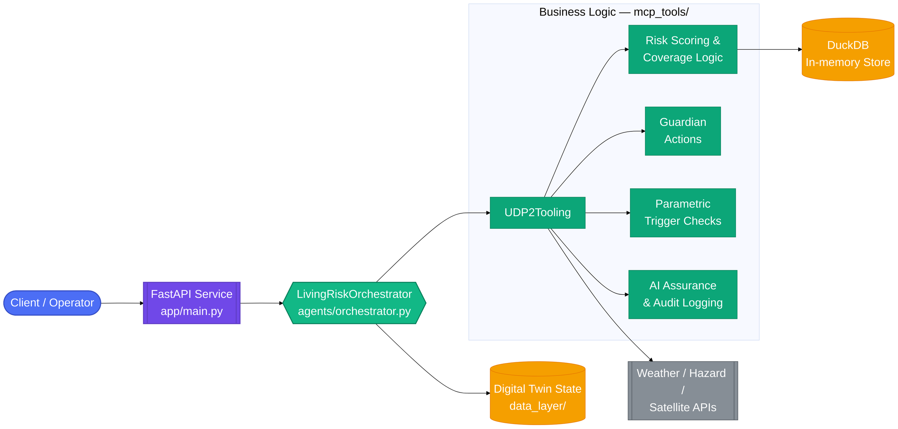
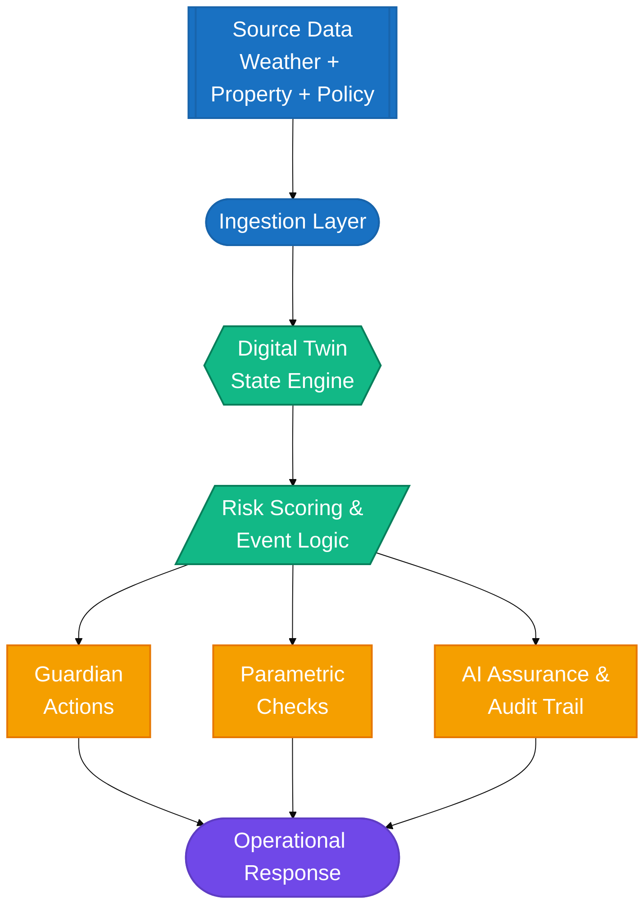

# UDP 2.0 Living Risk Engine

The UDP 2.0 Living Risk Engine is an insurance digital-twin reference application for telemetry-driven risk prevention. It combines a FastAPI service, orchestration logic, AI-assisted decisioning, and deployment assets for local, Azure, and GCP execution.

## Overview

This repository models a modern insurance workflow where telemetry, underwriting context, risk scoring, and preventive action are combined into a single operational loop. The system supports:

- telemetry ingestion and location-based risk assessment
- policy onboarding and prefill flows
- contextual coverage recommendations
- digital-twin risk state tracking
- active loss-prevention actions
- traceable AI assurance and audit logging

## Core capabilities

- real-time twin state management for insured locations or assets
- event-driven signal processing for weather, IoT, or exposure changes
- policy-aware coverage recommendations
- active action detection and preventive guidance
- X-Trace-ID propagation for observability and auditability
- local-first execution with Azure and GCP deployment scripts

## Architecture at a glance



## Repository map

```text
udp2-living-risk-engine/
├── agents/                       # orchestration and risk-processing logic
├── app/                          # FastAPI application and HTTP endpoints
├── data_layer/                   # domain schemas, models, and simulation helpers
├── deployment/                   # Docker and cloud deployment assets
├── docs/                         # deployment and architecture documentation
├── infrastructure/               # Azure / GCP infra templates and references
├── mcp_tools/                    # tool gateway, trace helpers, and policy logic
├── src/                          # application package roots and runtime helpers
├── tests/                        # project tests
├── .gitignore
├── DEPLOYMENT_GUIDE.md           # broader deployment and architecture guide
├── README.md                     # project overview and navigation
├── requirements.txt              # Python dependencies
└── deployment/docker-compose.yml  # local containerized execution file
```

## Quick start

### 1) Install dependencies

```bash
python -m venv .venv
# Windows: .venv\Scripts\activate
# macOS/Linux: source .venv/bin/activate
pip install -r requirements.txt
```

### 2) Run locally

```bash
python -m uvicorn app.main:app --reload --port 8080
```

### 3) Check health

```bash
curl http://localhost:8080/health
```

## API surface

The application exposes the following endpoints:

- `POST /api/v1/signal/ingest`
- `POST /api/v1/onboarding/prefill`
- `POST /api/v1/coverage/recommend`
- `GET /api/v1/twin/state/{location_id}`
- `GET /api/v1/actions/active`
- `GET /health`

All requests can carry the `X-Trace-ID` header for correlation across operations.

## Local deployment

For containerized local execution use the deployment compose file:

```bash
docker compose -f deployment/docker-compose.yml up --build
```

See:

- [docs/local-deployment.md](docs/local-deployment.md)
- [DEPLOYMENT_GUIDE.md](DEPLOYMENT_GUIDE.md)

## Azure deployment

The repo includes Azure deployment automation for Azure Container Apps.

```bash
bash deployment/deploy_azure.sh
```

See:

- [docs/azure-deployment.md](docs/azure-deployment.md)

## GCP deployment

The repo includes GCP deployment automation for Cloud Run.

```bash
bash deployment/deploy_gcp.sh
```

See:

- [docs/gcp-deployment.md](docs/gcp-deployment.md)

## Architecture references

The system is built around an insurance digital-twin architecture with policy-aware orchestration and AI-assisted risk decisions.



See:

- [docs/udp-architecture.md](docs/udp-architecture.md)
- [docs/ai-overview.md](docs/ai-overview.md)
- [docs/api-reference.md](docs/api-reference.md)

## Testing

Run the project tests with:

```bash
pytest -q
```

The current suite validates the core application behaviors and API contract.

## Documentation index

- [docs/local-deployment.md](docs/local-deployment.md)
- [docs/azure-deployment.md](docs/azure-deployment.md)
- [docs/gcp-deployment.md](docs/gcp-deployment.md)
- [docs/udp-architecture.md](docs/udp-architecture.md)
- [docs/ai-overview.md](docs/ai-overview.md)
- [docs/api-reference.md](docs/api-reference.md)
- [DEPLOYMENT_GUIDE.md](DEPLOYMENT_GUIDE.md)

## Notes

This repository is intended as a reference implementation for local experiments, cloud deployment testing, and enterprise prototype scenarios. The codebase is structured to keep the application simple and deployable while still reflecting realistic insurance and risk-monitoring workflows.
