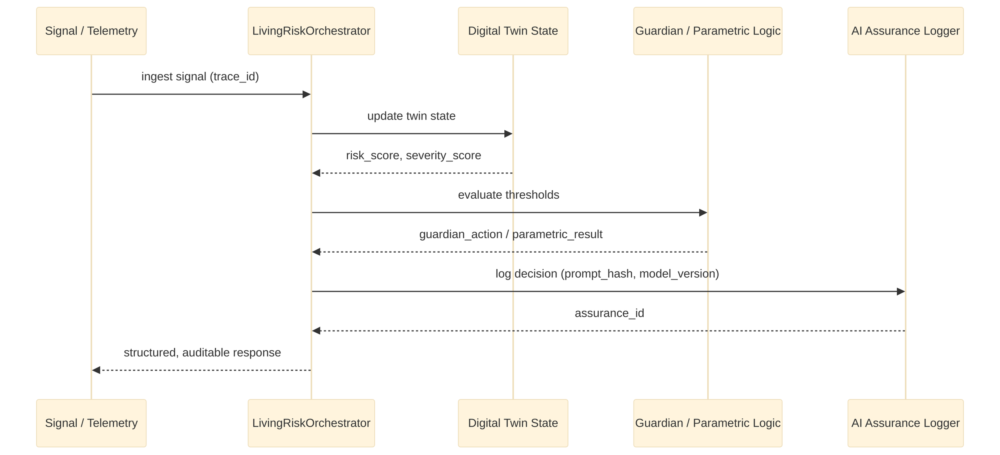

# AI and Assurance Overview

This project includes AI-oriented orchestration and assurance patterns that support risk decisions without losing accountability.

## Assurance flow diagram

## AI system goals

The system aims to:

- evaluate dynamic risk conditions from telemetry and policy context
- recommend timely preventive actions
- surface decision evidence in a structured format
- maintain traceability for downstream compliance review

## Assurance model

The app logs execution metadata such as:

- trace ID
- agent name
- model version
- prompt hash
- safety score
- execution status

This provides a lightweight audit trail for AI-assisted decisioning.

## Risk decision flow

A typical risk decision path is:

1. receive a signal
2. update the twin state
3. compute the risk score
4. trigger guardian action if threshold is crossed
5. evaluate policy payout or coverage response
6. log the decision in the assurance record

## Operational relevance

This pattern is useful for operational insurance scenarios where model decisions must be explained, traceable, and aligned with business rules.

## Related docs

- [../README.md](../README.md)
- [../DEPLOYMENT_GUIDE.md](../DEPLOYMENT_GUIDE.md)
- [udp-architecture.md](udp-architecture.md)
- [api-reference.md](api-reference.md)
