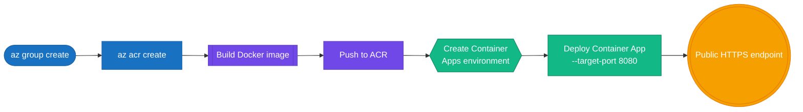

# Azure Deployment Guide

This guide covers deploying the UDP 2.0 Living Risk Engine to Azure using the included deployment script.

## Azure deployment flow



## Prerequisites

- Azure CLI installed and authenticated
- Docker installed
- An active Azure subscription
- Access to create resource groups and Container Apps

## Deployment script

Use:

```bash
bash deployment/deploy_azure.sh
```

## What the script does

The Azure deployment script performs the following:

1. Creates the resource group
2. Creates Azure Container Registry
3. Logs in to the registry
4. Builds the container image from the repository Dockerfile
5. Pushes the image to ACR
6. Creates a Container Apps environment
7. Deploys the app to Azure Container Apps with public ingress

## Configuration values

The script uses the following defaults:

- resource group: `rg-udp2-living-risk`
- location: `eastus`
- ACR name: `acrudp2livingrisk`
- container app name: `udp2-living-risk-engine`

## Notes

- You may want to adjust naming and region values to match your subscription constraints.
- Container app ports are configured to expose the service on port 8080.

## Related docs

- [../README.md](../README.md)
- [../DEPLOYMENT_GUIDE.md](../DEPLOYMENT_GUIDE.md)
- [local-deployment.md](local-deployment.md)
- [gcp-deployment.md](gcp-deployment.md)
