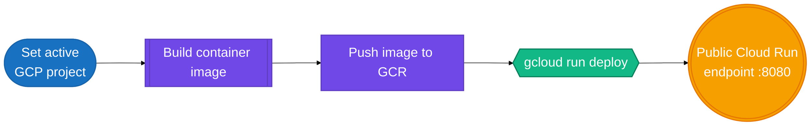

# GCP Deployment Guide

This guide covers deploying the UDP 2.0 Living Risk Engine to Google Cloud Run.

## GCP deployment flow



## Prerequisites

- Google Cloud SDK (`gcloud`) installed and authenticated
- A GCP project selected with billing enabled
- Docker installed

## Deployment script

Use:

```bash
bash deployment/deploy_gcp.sh
```

## What the script does

The script:

1. Reads the active GCP project
2. Builds a container image from the repository Dockerfile
3. Pushes the image to Google Container Registry
4. Deploys the app to Cloud Run with public access
5. Uses port 8080 for the service

## Configuration values

The script uses the following defaults:

- region: `us-central1`
- image name: `gcr.io/${PROJECT_ID}/udp2-living-risk-engine:latest`
- service name: `udp2-living-risk-engine`

## Notes

- Set your active GCP project first using `gcloud config set project <project-id>`.
- Update the region if your environment requires another deployment location.

## Related docs

- [../README.md](../README.md)
- [../DEPLOYMENT_GUIDE.md](../DEPLOYMENT_GUIDE.md)
- [local-deployment.md](local-deployment.md)
- [azure-deployment.md](azure-deployment.md)
