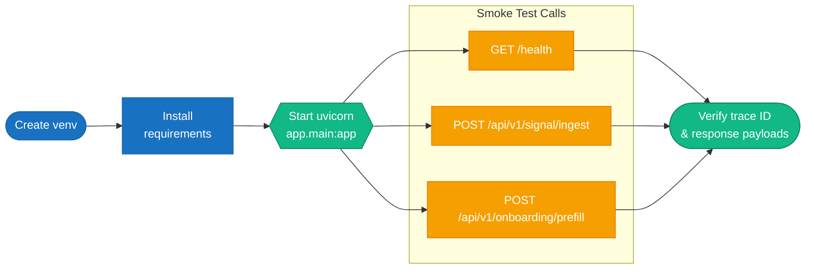

# Local Deployment Guide

This document describes how to run the UDP 2.0 Living Risk Engine locally in a development environment.

## Deployment flow



## Prerequisites

- Python 3.11+
- pip
- Docker (optional, for containerized local run)

## 1. Create a virtual environment

```bash
python -m venv .venv
source .venv/bin/activate
# Windows:
# .venv\Scripts\activate
```

## 2. Install dependencies

```bash
pip install -r requirements.txt
```

## 3. Start the API

```bash
python -m uvicorn app.main:app --reload --port 8080
```

The application will be available at:

```text
http://localhost:8080
```

## 4. Verify the service

```bash
curl http://localhost:8080/health
```

Expected response includes the service status and a trace identifier.

## 5. Run the test suite

```bash
pytest -q
```

## Containerized local run

The repo includes a compose file for local container orchestration:

```bash
docker compose -f deployment/docker-compose.yml up --build
```

This builds the image from the deployment Dockerfile and exposes the app on port 8080.

## Useful examples

### Health check

```bash
curl http://localhost:8080/health
```

### Signal ingestion

```bash
curl -X POST http://localhost:8080/api/v1/signal/ingest \
  -H "Content-Type: application/json" \
  -H "X-Trace-ID: local-trace-1" \
  -d '{
    "location_id": "LOC-001",
    "signal_type": "storm",
    "source_system_code": "OWM",
    "telemetry": {"wind_mph": 90, "hail_inches": 0.7}
  }'
```

## Related docs

- [../README.md](../README.md)
- [../DEPLOYMENT_GUIDE.md](../DEPLOYMENT_GUIDE.md)
- [azure-deployment.md](azure-deployment.md)
- [gcp-deployment.md](gcp-deployment.md)
