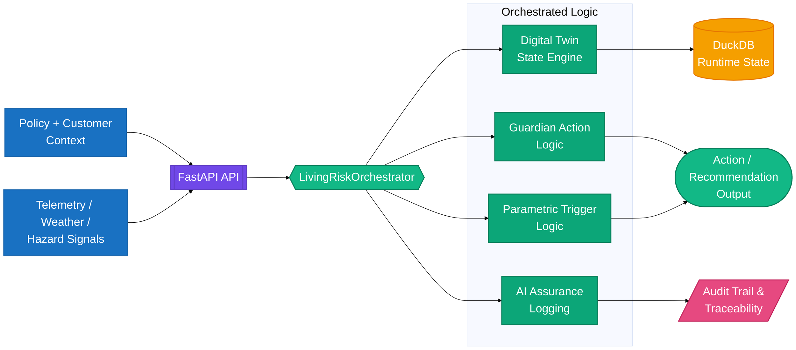

# UDP 2.0 Architecture Overview

This document describes the architecture model used by the UDP 2.0 Living Risk Engine.

## Design intent

The project is intended to represent an insurance digital twin that continuously assesses exposure, monitors risk, and can generate preventive actions before a loss event escalates.

## System diagram

## Core architecture layers

### 1. API layer

The FastAPI application serves the operational surface for onboarding, ingestion, coverage, and state queries.

Key responsibilities:

- accept incoming telemetry or policy context
- route requests through the orchestration layer
- propagate trace IDs
- return structured, auditable responses

### 2. Orchestration layer

The orchestrator sits above the data and tool layers and coordinates the execution path for incoming signals.

Typical flow:

1. ingest location and signal metadata
2. update the digital twin state
3. compute live risk score
4. trigger guardian action if threshold is breached
5. evaluate parametric payout logic
6. recommend contextual coverage
7. log assurance metadata

### 3. Tooling and MCP layer

The tool layer centralizes business logic for:

- customer context and policy data
- event-based twin refresh
- risk computation
- coverage recommendation
- guardrail and assurance logging

This creates a clean boundary between application endpoints and core business rules.

### 4. Data layer

The project uses in-memory DuckDB-backed tables to model risk and policy state during runtime. This enables fast local development and testability without a full cloud data stack.

## Digital twin model

The system models a living risk state for a location or asset using data such as:

- policy details
- twin status
- risk object metadata
- events and telemetry
- scoring outputs
- preventive actions

## Observability model

Each request can carry an `X-Trace-ID` to provide request-level correlation. This makes it easier to trace signal ingestion, policy actions, and AI assurance logs.

## Related docs

- [../README.md](../README.md)
- [../DEPLOYMENT_GUIDE.md](../DEPLOYMENT_GUIDE.md)
- [ai-overview.md](ai-overview.md)
- [api-reference.md](api-reference.md)
